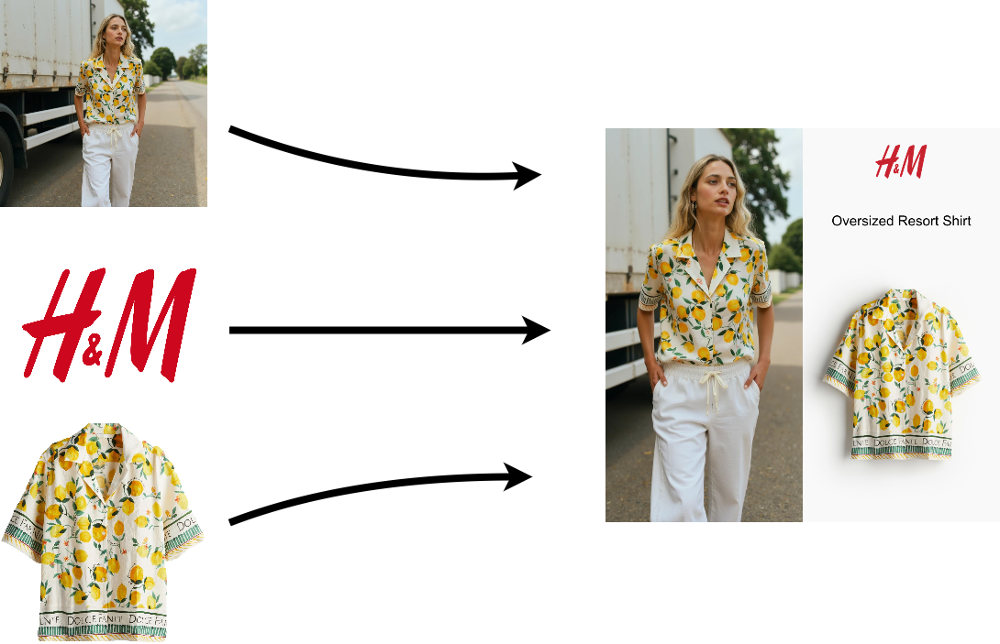

# Instagram Fashion Collage Creator 📸✨

This tool combines three images—the model wearing a piece of apparel, the product image, and the store logo—with the product name input, to create an engaging, Instagram-friendly collage. The final result is a stunning square image, perfectly suited for Instagram posts.



## Features 🌟

- **Human Detection and Image Cropping**: Model Image Cropping: The Google Cloud Platform (GCP) Vision API is used to identify the human figure, and the Sharp library is then utilized to crop the identified boundaries. 🧑‍🤝‍🧑
- **Product Image Resizing**: The apparel image is resized and aligned to fit alongside the model image, ensuring a clean, non-cropped view of the product. 👗
- **Logo Placement**: The store’s logo is placed in a visually balanced position on the final image. 🏷️
- **Text Overlay**: The product's name is added to the image for clear branding. 📝

## Improvements & To-Dos 🚀

- **Error Handling**: Improve error handling for missing or invalid image inputs. ⚠️
- **Support for Multiple Image Formats**: Expand support for more image formats (e.g., TIFF, BMP) beyond PNG and JPG. 📁

## Requirements ⚙️
- Node.js (v14+)
- `sharp` for image manipulation
- `@google-cloud/vision` for object detection (used for cropping the model image)
- Image files: model image, product image, and store logo

## Setup 🛠️

1. Clone this repository:
   ```bash
   git clone https://github.com/patrik-svensson/insta-image-creator.git
   cd insta-image-creator
   ```

2. Install dependencies:
   ```bash
   npm install
   ```

3. Set up your Google Cloud Vision API credentials by following [Google's documentation](https://cloud.google.com/docs/authentication/getting-started). Ensure the `GOOGLE_APPLICATION_CREDENTIALS` environment variable is set to the path of your credentials JSON file.

4. Place your model image, product image, and store logo in the appropriate directories.

## Usage 🚀

Configure the paths for your model, product image, and logo in the script:

```js
const MODEL_PATH = 'path/to/model-image.jpg';
const PRODUCT_IMAGE_PATH = 'path/to/product-image.jpg';
const LOGO_IMAGE_PATH = 'path/to/logo.png';
const OUTPUT_PATH = 'path/to/output-image.jpg';
```

Then, run the script to generate the final image:

```bash
tsc
npm start
```

The script will generate a square Instagram-ready image with the model, product, and logo combined, and save it to the `OUTPUT_PATH`.

